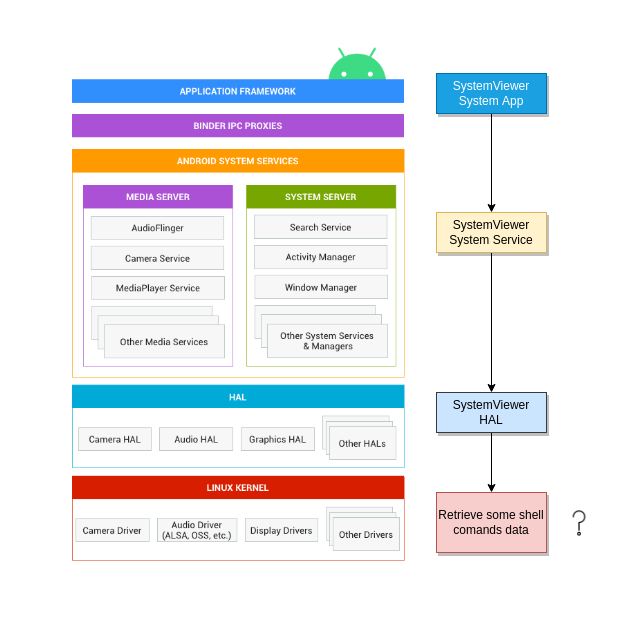

# AOSP-AndroidHAL
Investigating and discovering Android HAL.

## Idea
The goal of this project is to create an app that connects to a system service interfacing with HAL in order to retrieve some information from Linux Kernel. The main idea is an app that shows system information like hardware info, processes running and CPU and memory usage.

## Architecture

## Sources
- [Embedded Android [Book]](https://www.oreilly.com/library/view/embedded-android/9781449327958/)
- [Android Architecture](https://source.android.com/devices/architecture)
- [Creating the HAL Interface](https://source.android.com/devices/architecture/configstore/interface)
- [Vehicle HAL (VHAL)](https://source.android.com/devices/automotive/vhal/properties)
